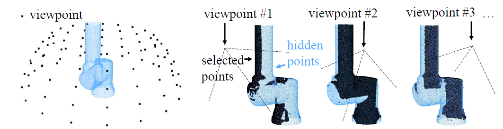
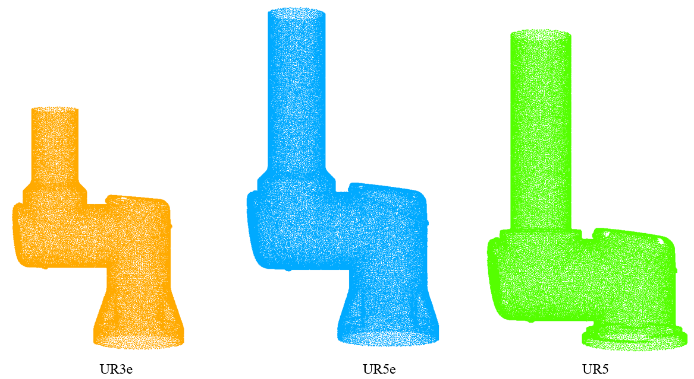

# Robot Base Dataset

The dataset can be downloaded from [here](https://1drv.ms/u/s!AnRiouA_fmTVi6F0gMuH_eAMiYWPnA?e=Q9E6a0).

In robot base registration, a dataset containing the ground truth data is required. In this dataset we have hundreds of aligned point cloud pairs. First, we simulate several viewpoints around the robot base as shown below, and the seen points (selected points) are estimated at the current viewpoint (black points).

  

Before that, a robot base point cloud is required, here we provide UR\*_base. They look like the following

  

In our dataset, the 