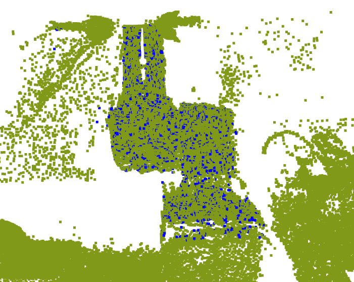

# Hand-eye Calibration Using Only One Point Cloud

This project is to provide an introduction to our proposed method, ***A Novel Hand-eye Calibration Method Leveraging by A Point Cloud of Robot Base***.

## *Abstract*

Hand-eye calibration is a fundamental task in vision-based robotic systems, referring to the calculation of the relative transformation between the camera and the robotic end-effector. It has been studied for many years. However, most methods still rely on external markers or even human assistance. This paper proposes a one-click and fully automatic hand-eye calibration method using 3D point clouds obtained from a 3D camera. With just one frame of data, hand-eye calibration is performed much faster than conventional methods. This is achieved by the detection and registration of the robot base. In addition, the calibration is performed automatically using only one native calibration object, the robot base, which simplifies the process. Our proposed method is tested for repeatability and accuracy through a series of experiments. Finally, a grasping task is performed to demonstrate its performance in a real-world application.

## Demo

### Detection of Robot Base

Here we captured more than a series of point clouds from a
[3D camera](https://github.com/leihui6/PMD_Camera). The raw point clouds are green and the Regions of Interest (ROIs) are blue (they are the same size, so they might be a bit hard to see :) ).

  
  
 
 
 
 
 

### Registration of Robot Base

These ROIs that extracted from raw point clouds is aligned with a model of robot base (actually is a point cloud as well), the registration result is shown on the right
  
 
 
 
 
 
 

### Hand-eye Calibration

In fact, we can perform a hand-eye calibration with only a single point cloud. Therefore, we executed hundreds of calibrations (**eye-in-hand calibration**) during each data acquisition. The result is shown on the right, where the camera image is displayed close to the end-effector.

  
 
 
 
 
 
 
## Implement Details

**[PREDATOR](https://github.com/prs-eth/OverlapPredator)**, a learning-based point cloud registration framework is applied in our project. In addition, the **[PV-RCNN++](https://github.com/open-mmlab/OpenPCDet)** as a 3D detection module to provide a rough location of the robot base is employed in our method. According to the evaluation result and experiments, their performance is excellent compared with other conventional registration methods (more details in the paper).

We here utilized real-world data to train these framework. The trained model in terms of PREDATOR and PV-RCNN++ can be downloaded as follows: 
- [Detection/Trained model](https://1drv.ms/u/s!AnRiouA_fmTVh6UpNm4gtWq02GF8JA?e=luChZi): This model can be used for UR3e and UR5e robot base detection task
- [Registration/Trained model](https://1drv.ms/u/s!AnRiouA_fmTVh6UnauE3yxdVcgU5qQ?e=2oMayu): This model can be used for robot base registration. A model of robot base can be obtained from [here](./data/UR5e_base.txt).

## Papers

Coming soon hopefully 😜

## Contribution

This project is maintained by @[Leihui Li](https://github.com/leihui6), please be free to contact me if any questions.
