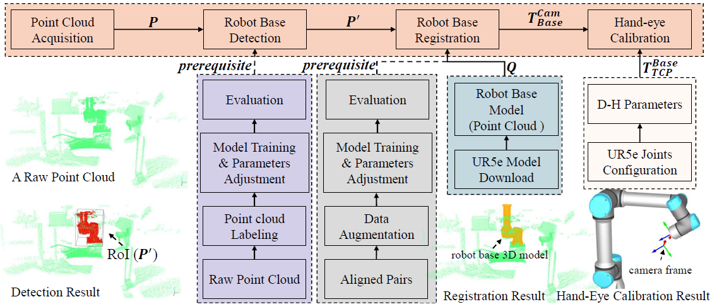
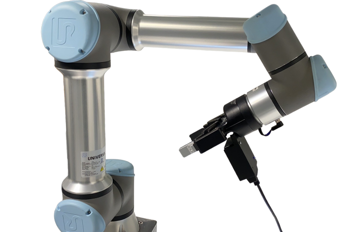
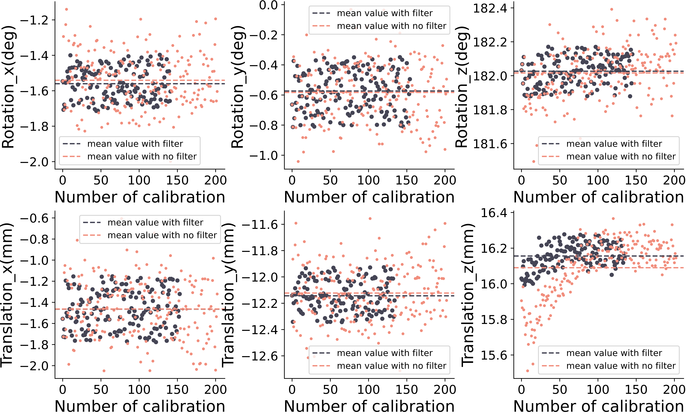

# Look at Robot Base Once: Hand-Eye Calibration with Point Clouds of Robot Base Leveraging Learning-Based 3D Vision

Welcome to our project: Look at Robot Base (**LRBO**): A Hand-eye Calibration using 3D Vision

Our proposed method has **THREE** features:

1. *[**EASY**]* It doesn't require any additional calibration objects (**No calibration objects**), such as a chessboard or something like that.
2. Hand-eye calibration can be done with **only point clouds**.
3. *[**FAST**]* The processing time is fast (**1 sec**) and the result is as accurate as other 3D vision-based methods.
4. Overall, it is a **fully automatic** hand-eye calibration.

## Content

In this repository, we will try to provide some tutorials and videos that give more details and performance of our method. We believe that our proposed method has more potential to be used in the industrial field and applications such as vision-based grasping, assembly and quality inspection.

## Abstract

Hand-eye calibration is a fundamental task in vision-based robotic systems, referring to the calculation of the relative transformation between the camera and the robotic end-effector. It has been studied for many years. However, most methods still rely on external markers or even human assistance. This paper proposes a one-click and fully automatic hand-eye calibration method using 3D point clouds obtained from a 3D camera. Our proposed hand-eye calibration is performed much faster than conventional methods. This is achieved by the learning-based detection and registration of the robot base. In addition, the calibration is performed automatically using only one native calibration object, the robot base, which simplifies the process. Our proposed method is tested for repeatability and accuracy through a series of experiments.

## Pipeline

The pipeline for our proposed method is shown below, where eye-in-hand calibration is taken as an example because it is more complex compared to eye-to-hand calibration. The estimation of the transformation matrix between the camera and the robot base is a common problem for them.
  

The dataset generation for the robot base is elaborated here.(coming soon)

## Demo & Video

### Detection of Robot Base

Here we captured more than a series of point clouds from a [3D camera](https://github.com/leihui6/PMD_Camera). The raw point clouds are green and the Regions of Interest (ROIs) are blue (they are the same size, so they might be a bit hard to see :).

  

### Registration of Robot Base
These ROIs that extracted from raw point clouds is aligned with a model of robot base (actually is a point cloud as well), the registration result is shown below

 

### Hand-eye Calibration

In fact, we can perform a hand-eye calibration with only a single point cloud. Therefore, we executed hundreds of calibrations (**eye-in-hand calibration**) during each data acquisition. The result is shown below, where the camera image is displayed close to the end-effector.

  

### Video

The video and tutorial are coming soon.

## Repeatability Experiment
By measuring the variability in the results, repeatability experiments can provide insight into the stability and robustness of the calibration method and ensure that the results are not merely due to random fluctuations. Therefore, more than 200 hand-eye calibration were conducted in 300 sec (**surprise**?!). The results are shown below.

 

## Accuracy Experiment
Two types of testing are performed, called static testing and dynamic testing. Static testing is considered the ground truth.

| Method 	|    Position error (mm)    	| Rotation error (deg) 	| Runtime 	|  Camera Type 	|
|:------:	|:-------------------------:	|:--------------------:	|:-------:	|:------------:	|
|  Ours  	| **X**: 1.874 **Y**:1.092 **Z**: 0.303 	|         0.391        	|   1.5 + 5 (move)   	| ToF   Camera 	|
|  Ours  	| **X**: 1.159 **Y**:0.697 **Z**: 1.025 	|         0.994        	|  <1 + 5 (move)   	| Structured of Light   Camera 	|

## Implement Details

**[PREDATOR](https://github.com/prs-eth/OverlapPredator)**, a learning-based point cloud registration framework is applied in our project. In addition, the **[PV-RCNN++](https://github.com/open-mmlab/OpenPCDet)** as a 3D detection module to provide a rough location of the robot base is employed in our method. According to the evaluation result and experiments, their performance is excellent compared with other conventional registration methods (more details in the paper).

We here utilized real-world data to train these framework. The trained model in terms of PREDATOR and PV-RCNN++ can be downloaded as follows: 
- [Detection/Trained model](https://1drv.ms/u/s!AnRiouA_fmTVh6UpNm4gtWq02GF8JA?e=luChZi): This model can be used for UR3e and UR5e robot base detection task
- [Registration/Trained model](https://1drv.ms/u/s!AnRiouA_fmTVh6UnauE3yxdVcgU5qQ?e=2oMayu): This model can be used for robot base registration. A model of robot base can be obtained from [Here](./data/UR5e_base.txt).

## Papers

Coming soon hopefully :)

## Contribution

This project is maintained by @[Leihui Li](https://github.com/leihui6), please be free to contact me if any questions.
